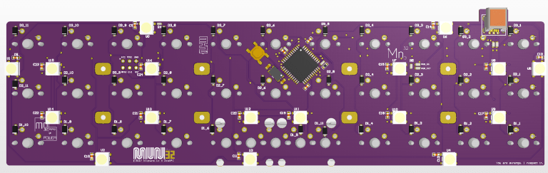

# Miuni32 



## What is it?

A 30%-sized, compact, on-the-go mechanical keyboard PCB for keyboard enthusiasts.

- Ortholinear
- 32 keys (2U space bar or 1U + 1U configurations)
- Atmega32u4 MCU
- SMD components
- 7 + 10 underglow RGB LEDs
- [QMK supported](https://github.com/bigtunaIO/qmk_firmware/)

## Dimensions

## Firmware
### Download official release

Go to the [release page](https://github.com/bigtunaIO/qmk_firmware/releases/tag/miuni32-revision-2) and download `miuni32-default.hex` file.

### Compile from source

Download the official [qmk-firmware](https://github.com/qmk/qmk_firmware) source code before proceeding.

#### Linux

Simply run the following from the top directory:

```bash
$ make miuni32
QMK Firmware 0.6.211              
Making miuni32 with keymap default [OK]        
```

You will find `miuni32_default.hex` in your `qmk_firmware` directory!

### Flash

#### Linux

First, hit the `reset` button on Miuni32. Then run the following commands from the directory you stored the firmware:

```bash
sudo dfu-programmer atmega32u4 erase
sudo dfu-programmer atmega32u4 flash miuni32_default.hex
sudo dfu-programmer atmega32u4 start
```

## Bill of Materials
| Comment                           | Description                                                                                               | Designator                                                                                                                                                                                                 | Quantity | Octopart URL                                                     |
|-----------------------------------|-----------------------------------------------------------------------------------------------------------|------------------------------------------------------------------------------------------------------------------------------------------------------------------------------------------------------------|----------|------------------------------------------------------------------|
|                                   |                                                                                                           |                                                                                                                                                                                                            |          |                                                                  |
| Capacitors                        |                                                                                                           |                                                                                                                                                                                                            |          |                                                                  |
| 18 pF                             | 18 pF, 0603                                                                                               | C1, C2                                                                                                                                                                                                     | 2        | http://octopart.com/cc0603jrnpo9bn180-yageo-8292531              |
| 0.1 µF                            | 0.1 uF, 0603                                                                                              | C3, C4, C5, C8, C9, C10, C11, C12, C13, C14, C15, C16, C17, C18, C19, C20, C21, C22, C23, C24                                                                                                              | 20       | http://octopart.com/cc0603krx7r7bb104-yageo-192941               |
| 1 µF                              | 1µF, 0603                                                                                                 | C6, C7                                                                                                                                                                                                     | 2        | http://octopart.com/cc0603krx7r7bb105-yageo-42271928             |
| Diodes                            |                                                                                                           |                                                                                                                                                                                                            |          |                                                                  |
| 1N4148W                           | 2 A 100 V 400 mW - SOD-123                                                                                | D1_1, D1_2, D1_3, D1_4, D1_5, D1_6, D1_7, D1_8, D1_9, D1_10, D1_11, D2_1, D2_2, D2_3, D2_4, D2_5, D2_6, D2_7, D2_8, D2_9, D2_10, D2_11, D3_1, D3_2, D3_3, D3_4, D3_5, D3_6, D3_7, D3_8, D3_9, D3_10, D3_11 | 33       | http://octopart.com/1n4148w-7-f-diodes+inc.-55386411             |
| Resistors                         |                                                                                                           |                                                                                                                                                                                                            |          |                                                                  |
| 22 Ohm                            | 22 Ohm, 0603                                                                                              | R1, R2                                                                                                                                                                                                     | 2        | http://octopart.com/rc0603fr-0722rl-yageo-1405859                |
| 1 k Ohm                           | 1 k Ohm, 0603                                                                                             | R3                                                                                                                                                                                                         | 1        | http://octopart.com/rc0603fr-071kl-yageo-55402882                |
| 470 Ohm                           | 470 Ohm, 0603                                                                                             | R4, R5                                                                                                                                                                                                     | 2        | http://octopart.com/rc0603fr-07470rl-yageo-39823780              |
| 0 Ohm                             | 0 Ohm 0603                                                                                                | RGB_2ND or RGB_ext (default)                                                                                                                                                                               | 1        | http://octopart.com/rc0603jr-070rl-yageo-1241539                 |
|                                   |                                                                                                           |                                                                                                                                                                                                            |          |                                                                  |
| Omron XM7D-0512                   | USB Connector; Type: mini-B-type socket; Number of Contacts: 5; Terminal Shape: Right-angle DIP terminals | J1                                                                                                                                                                                                         | 1        | http://octopart.com/xm7d-0512-omron-34177284                     |
| Texas Instruments ESD122DMYR      | ESD Suppressors TVS 3-Pin X2SON T/R                                                                       |                                                                                                                                                                                                            | 1        | https://octopart.com/esd122dmyr-texas+instruments-83003494       |
| TE Connectivity / AMP 8-1437565-0 | Switch Tactile OFF (ON) SPST Round Button Gull Wing 0.02A 15VDC 1.57N SMD T/R                             | SW1                                                                                                                                                                                                        | 1        | http://octopart.com/8-1437565-0-te+connectivity+%2F+amp-40419826 |
| WS2812B                           | RGB LED                                                                                                   | U0, U1, U2, U3, U4, U5, U6, U7, U8, U9, U10, U11, U12, U13, U14, U15, U16                                                                                                                                  | 17       |                                                                  |
| TPD1E10B06DPYR                    | ESD in 0402 Package 1 Channel, -40 to +125 degC, 2-pin X2SON (DPY)                                        | U17                                                                                                                                                                                                        | 1        | https://octopart.com/tpd1e10b06dpyr-texas+instruments-22024341   |
| Atmel ATMEGA32U4-AU               | MCU, 8BIT, MEGAAVR, 16MHZ, TQFP-44                                                                        | U100                                                                                                                                                                                                       | 1        | https://octopart.com/atmega32u4-aur-microchip-15718526           |
| TXC 7B-16.000MAAJ-T               | CRYSTAL 16.000MHZ 18PF SMD                                                                                | Y1                                                                                                                                                                                                         | 1        | https://octopart.com/7b-16.000maaj-t-txc-18628265                |


## Links

* www.bigtuna.io
* www.github.com/bigtunaio
